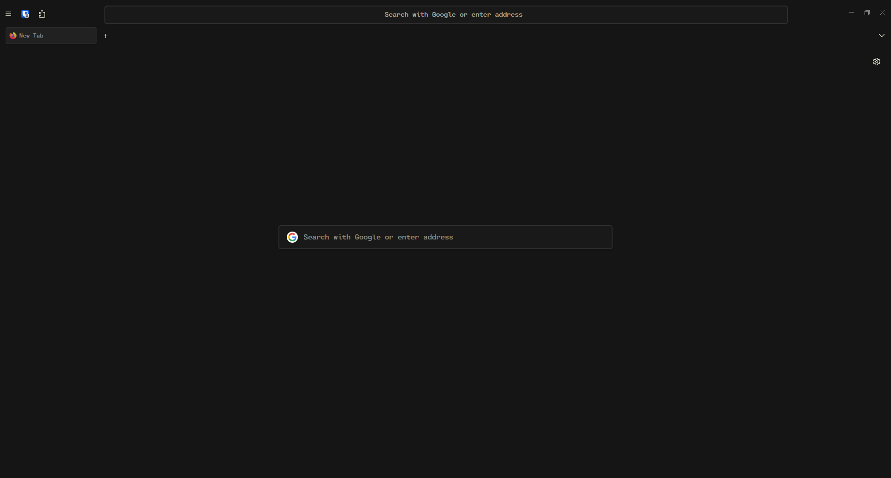

<h1>- Firefox CSS -</h1>
Custom User CSS for Firefox

## Previews
> Jellybeans

> Tokyo Night

## Overview
- `jellybeans-fox/`
    - `chrome/` : contains the firefox css based on 
the jellybeans.vim theme
- `tokyo-night-fox/`
    - `chrome/` : contains the firefox css based on 
the tokyo-night theme
-  `fonts/` : 
    - `CartographCF` : Required font. Put this folder in your `.local/share/fonts` directory.

## Installation

1. Go to *`about:config`* and enable *`toolkit.legacyUserProfileCustomizations.stylesheets`*.

2. Locate your profile location by going to *`about:support`* and clicking *`Open Directory`* in *`Profile folder`* (Usually ends with *`.default-release`*)

3. Clone this repository by running `https://github.com/rototrash/firefox-css.git`.

4. Paste the `chrome` folder into the correct profile folder.
    > Ex. If you want the Jellybeans theme, put the chrome folder from `jellybeans-fox` directory of this repo into your correct .profile folder

5. Copy these customization settings to get the exact spacing and look you see in the preview. You can use the `Customize Toolbar > Flexible Spaces` for the gaps.
    - Jellybeans CSS
    

    - Tokyo Night CSS
    

6. Paste the contents of the `font` directory into your `~/.local/share/fonts` directory.

## Note:
- **For jellybeans-fox css:** 
I highly recommend getting this firefox theme: [`https://addons.mozilla.org/en-US/firefox/addon/jellybeans-vim/`](https://addons.mozilla.org/en-US/firefox/addon/jellybeans-vim/) and the CartographCF Nerd font.

- **For tokyo-night-fox css:**
I highly recommend installing this firefox theme: [`https://addons.mozilla.org/en-US/firefox/addon/tokyo-night-theme/`](https://addons.mozilla.org/en-US/firefox/addon/tokyo-night-theme/) and the JetBrains Mono Nerd font (`yay -S nerd-fonts-jetbrains-mono` if you are on Arch-based system) 

 ## DuckDuckGo

Want to get this DuckDuckGo theme? Go to [`https://duckduckgo.com/settings#theme`](https://duckduckgo.com/settings#theme) and enter the passphrase **`tokyo-night`**.

## Credits

* **Forked from Nightfox:** [`https://github.com/snthcy/nightfox`](https://github.com/snthcy/nightfox)  
* **Nightfox is based off of:** [`https://github.com/datguypiko/Firefox-Mod-Blur`](https://github.com/datguypiko/Firefox-Mod-Blur)
